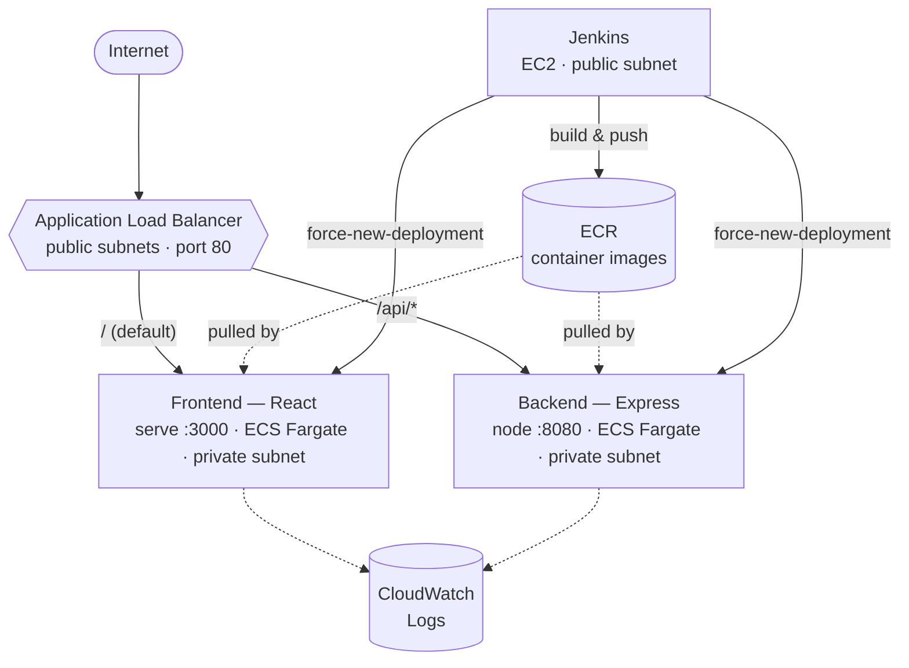

# DevOps Code Challenge — Three-Tier App on AWS ECS Fargate

A React frontend and an Express backend, containerized with Docker, deployed to
**AWS ECS Fargate** behind an **Application Load Balancer**, provisioned entirely
with **Terraform**, and shipped through a **Jenkins CI/CD pipeline**.


**Live frontend:** `http://devops-challenge-alb-64585938.us-east-2.elb.amazonaws.com/`

---

## Architecture



**Provisioned by Terraform:**

| Component | Resource(s) | File |
|---|---|---|
| Network | VPC (`10.0.0.0/16`), 2 public + 2 private subnets, IGW, NAT gateway, route tables | `vpc.tf` |
| Load balancer | ALB, frontend/backend target groups, listener + `/api/*` rule | `alb.tf` |
| Compute | ECS cluster, frontend & backend task definitions + services (Fargate) | `ecs.tf` |
| Registry | ECR repos (frontend, backend) with lifecycle policies | `ecr.tf` |
| Autoscaling | Target-tracking CPU policies (min 1 / max 4 tasks) | `autoscaling.tf` |
| IAM | ECS task execution + task roles, security groups | `iam.tf` |
| CI/CD host | Jenkins EC2 (`t3.small`) + Elastic IP | `jenkins.tf` |
| Outputs | ALB DNS, ECR URLs, Jenkins URL, cluster name, etc. | `validate.tf` |

---

## Prerequisites

Install and configure the following on your machine:

| Tool | Purpose |
|---|---|
| [Terraform](https://developer.hashicorp.com/terraform/downloads) ≥ 1.5 | Provision infrastructure |
| [AWS CLI](https://docs.aws.amazon.com/cli/latest/userguide/getting-started-install.html) v2 | Auth + ECR/ECS commands |
| [Docker](https://docs.docker.com/get-docker/) | Build container images |
| [Node.js](https://nodejs.org/) ≥ 16 | Run/build the app locally |

Configure AWS credentials (region **us-east-2**):

```bash
aws configure
aws sts get-caller-identity   # verify you're the right account
```

---

## 1. Deploy the infrastructure (Terraform)

The Terraform lives in the repo root. Provider: `hashicorp/aws 6.0.0-beta2`, region
defaults to `us-east-2`. Key variables (see `variables.tf` for the full list):

| Variable | Default | Notes |
|---|---|---|
| `aws_region` | `us-east-2` | |
| `project_name` | `devops-challenge` | Prefix for every resource name |
| `environment` | `production` | |
| `frontend_port` | `3000` | |
| `backend_port` | `8080` | |
| `desired_tasks` | `1` | Tasks per service at steady state |
| `min_tasks` / `max_tasks` | `1` / `4` | Autoscaling bounds |
| `cpu_threshold` | `50` | Target CPU % for autoscaling |

### Steps

```bash
# from the repo root
terraform init
terraform plan
terraform apply        # type 'yes' to confirm
```

After apply, grab the outputs you'll need:

```bash
terraform output alb_dns_name             # public URL of the app
terraform output frontend_repository_url  # ECR repo for frontend image
terraform output backend_repository_url   # ECR repo for backend image
terraform output jenkins_url              # Jenkins UI (http://<eip>:8080)
```

> **Note on ordering:** the ECS services pull the `:latest` image from ECR. On a
> brand-new account those images don't exist until you push them (Step 2), so the
> tasks may fail their first start. Run Step 2 (or the Jenkins pipeline), then the
> services stabilize on the next deployment.

### Point the app at your ALB

The app has the backend URL **baked in at build time**, so after the ALB exists you
must set these two files to *your* ALB DNS and rebuild the images:

- `frontend/src/config.js` → `API_URL = 'http://<your-alb-dns>/api/'`  ← **trailing slash required**
- `backend/config.js` → `CORS_ORIGIN: 'http://<your-alb-dns>'`

> **Why the trailing slash matters:** the ALB routes `/api/*` to the backend. A bare
> `/api` (no slash) does **not** match `/api/*` and falls through to the frontend,
> which returns HTML instead of JSON — causing a "Failed to fetch" error in the
> browser. Always call `/api/`.

---

## 2. Build & push the container images

Both images are built and pushed to ECR. The frontend runs a static build via
`serve` (port 3000); the backend runs Express (port 8080).

```bash
AWS_REGION=us-east-2
ACCOUNT_ID=$(aws sts get-caller-identity --query Account --output text)
FRONTEND_REPO=$ACCOUNT_ID.dkr.ecr.$AWS_REGION.amazonaws.com/devops-challenge-frontend
BACKEND_REPO=$ACCOUNT_ID.dkr.ecr.$AWS_REGION.amazonaws.com/devops-challenge-backend

# authenticate Docker to ECR
aws ecr get-login-password --region $AWS_REGION \
  | docker login --username AWS --password-stdin $FRONTEND_REPO

# build, tag, push
docker build -t frontend:latest ./frontend
docker build -t backend:latest  ./backend
docker tag frontend:latest $FRONTEND_REPO:latest
docker tag backend:latest  $BACKEND_REPO:latest
docker push $FRONTEND_REPO:latest
docker push $BACKEND_REPO:latest

# roll the services onto the new images
aws ecs update-service --cluster devops-challenge-cluster \
  --service devops-challenge-frontend-service --force-new-deployment --region $AWS_REGION
aws ecs update-service --cluster devops-challenge-cluster \
  --service devops-challenge-backend-service  --force-new-deployment --region $AWS_REGION
```

Verify:

```bash
curl -i http://<your-alb-dns>/         # 200, HTML (React app)
curl -i http://<your-alb-dns>/api/     # 200, {"id":"<uuid>"}
```

---

## 3. Jenkins CI/CD setup

Terraform provisions a Jenkins host on EC2 (`t3.small`, public subnet, Elastic IP).
The pipeline is defined in [`Jenkinsfile`](Jenkinsfile) and does:
**Checkout → Build images → Auth to ECR → Tag & push → Force ECS redeploy**.

### One-time Jenkins configuration

1. **Open Jenkins:** `terraform output jenkins_url` → `http://<eip>:8080`.
   (Install Jenkins on the instance if you're bootstrapping it manually; unlock with
   the initial admin password from `/var/lib/jenkins/secrets/initialAdminPassword`.)

2. **Install plugins:** *Manage Jenkins → Plugins* →
   - Pipeline
   - Docker Pipeline
   - **AWS Credentials** (required for the `AmazonWebServicesCredentialsBinding` step)

3. **Add AWS credentials:** *Manage Jenkins → Credentials → System → Global → Add Credentials*
   - Kind: **AWS Credentials**
   - **ID: `aws`**  ← must match `credentialsId` in the Jenkinsfile exactly
   - Enter an IAM access key/secret that can push to ECR and update ECS.

4. **Create the pipeline job:** *New Item → Pipeline* →
   - Definition: *Pipeline script from SCM*
   - SCM: Git → your repo URL, branch `main`
   - Script path: `Jenkinsfile`

5. **Make sure Docker + AWS CLI are installed on the Jenkins agent** (the build runs
   `docker build` and `aws` directly on the host).

### Fill in the Jenkinsfile placeholders

Before the first run, confirm these values in [`Jenkinsfile`](Jenkinsfile) match your
environment (the account/region below are already set for this project):

| Placeholder | Correct value |
|---|---|
| `credentialsId` (both stages) | `aws` (the ID from step 3) |
| `AWS_REGION` | `us-east-2` |
| `FRONTEND_REPO` / `BACKEND_REPO` | your account's ECR URIs |
| `--cluster` | `devops-challenge-cluster` |
| frontend `--service` | `devops-challenge-frontend-service` |
| backend `--service` | `devops-challenge-backend-service` |

> **Common error:** `Could not find credentials entry with ID 'your-aws-credentials-id'`
> means a `credentialsId` placeholder wasn't replaced with `aws` (check **both**
> `withCredentials` blocks), or no credential with that ID exists in Jenkins yet.

Because the pipeline uses `checkout scm`, commit **and push** your changes before
running a build — Jenkins runs the committed `Jenkinsfile`, not your local edits.

---

## 4. Autoscaling & load-test results

Both services use **target-tracking autoscaling** on average CPU
(`autoscaling.tf`): target **50%**, **min 1 / max 4** tasks. When sustained CPU
crosses the target, ECS adds tasks (up to 4); when it falls, it scales back in.

### Load test (siege)

```bash
siege -c 250 -t 2M http://devops-challenge-alb-64585938.us-east-2.elb.amazonaws.com/
```

> Use `http://` — the ALB only has a port-80 listener, so `https://` will not
> connect. Do **not** double up the protocol (`https://http://...` is invalid).

Representative result (250 concurrent users):

| Metric | Result |
|---|---|
| Availability | **99.95 %** |
| Transactions | 2,189 hits |
| Successful / Failed | 2,189 / 1 |
| Transaction rate | ~143 req/sec |
| Concurrency | ~243 |
| Avg response time | ~1.7 s |

The single failed transaction under sustained 250-user load is expected noise (a
dropped keep-alive), not an application error. Sustained load drives CPU up, which
triggers the target-tracking policy to add Fargate tasks automatically.

Watch scaling happen during a load test:

```bash
watch -n 5 'aws ecs describe-services --cluster devops-challenge-cluster \
  --services devops-challenge-frontend-service devops-challenge-backend-service \
  --query "services[].[serviceName,runningCount,desiredCount]" --output text'
```

---

## Running the app locally (optional)

The backend must start first (it listens on `:8080`); the frontend on `:3000`.

```bash
cd backend  && npm ci && npm start
cd frontend && npm ci && npm start
```

Open `http://localhost:3000`. On a successful connection the page displays a GUID
returned by the backend. For local runs, set `frontend/src/config.js` back to
`http://localhost:8080/` and `backend/config.js` `CORS_ORIGIN` to
`http://localhost:3000`.

---

## Teardown

```bash
terraform destroy
```

This removes all AWS resources created by this project. ECR images are deleted with
the repositories; the Jenkins EC2 instance and its Elastic IP are released.

---

## Repository layout

```
.
├── *.tf                 # Terraform (vpc, alb, ecs, ecr, iam, autoscaling, jenkins, ...)
├── Jenkinsfile          # CI/CD pipeline (build → push → deploy)
├── frontend/            # React app + Dockerfile (serve, port 3000)
│   └── src/config.js    # API_URL → ALB /api/
└── backend/             # Express app + Dockerfile (node, port 8080)
    └── config.js        # CORS_ORIGIN → ALB
```
